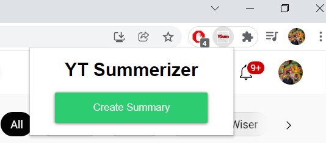

# Youtube-Summerizer

Ever thought of getting short summary for a YouTube Video and skip watching it ?
YouTube Summerizer Chrome Extension does that for you.

## How it Works?

- When on YouTube webpage, it extracts playing Youtube Video's ID from URL and then using YouTubeTranscriptApi, all its Transcript Captions.
- Using DistilBERT Language Model, Text Summarization is performed and Request(Transcript) & Response(Summary) are passed using hfapi (HuggingFace API)
- Flask is used to build backend, and deployed on Heroku.
- With One click 'Create Summary' it opens up New Webpage with Summary for the Video.

## Demo

Have a look at it in action here:

